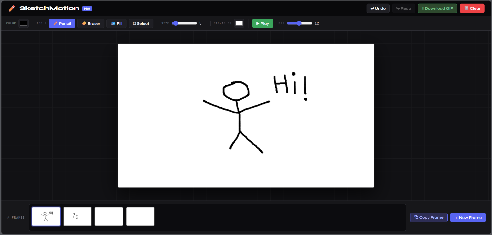

# ✏️ SketchMotion

**SketchMotion** is a browser-based pencil animation editor built using HTML5 Canvas and JavaScript.
It allows users to draw frame-by-frame animations and export them as GIFs — similar to basic animation tools like Flipaclip or Wick Editor.

---

## 🚀 Features

### ✏️ Drawing System

* Smooth pencil drawing using mouse
* Real-time stroke rendering
* Clean canvas-based drawing engine

### 🎞 Animation System

* Multiple frame support
* Add unlimited frames
* Frame switching with state saving
* ▶ Play animation loop

### 🧅 Onion Skin

* View previous frame with transparency
* Helps in smooth animation (like tracing)

### 🖼 Timeline & Frames

* Frame thumbnails preview
* Dynamic frame creation
* Copy frame feature

### ✂️ Editing Tools

* Selection tool (select part of drawing)
* Copy & paste selection
* Undo / Redo functionality

### 🎬 Export

* Download animation as GIF

---

## 🛠 Tech Stack

* HTML5
* CSS3
* JavaScript
* Canvas API

---

## 📌 How to Use

1. Open the app in browser
2. Draw using pencil tool
3. Add frames using ➕ button
4. Use onion skin to trace previous frame
5. Use undo/redo and selection tools
6. Click ▶ Play to preview animation
7. Export animation as GIF

---

## 🌐 Live Demo

[direct link](https://sketch-motion.vercel.app/)

---

## 📷 Screenshots

---

## 🎯 Learning Outcome

This project helped in understanding:

* Canvas drawing system
* Frame-based animation logic
* Event handling in JavaScript
* State management (frames, undo/redo)
* Exporting animations

---

## 👨‍💻 Author

Abhishek Kumar
B.Tech CSE Student
